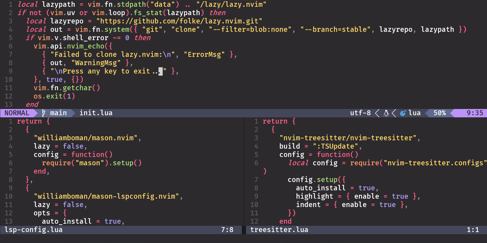

MochaVim
--------
.. image:: https://img.shields.io/badge/build%20(fedora)-passing-blue?logo=fedora&style=for-the-badge
   :alt: Build = Passing
   :target: https://github.com/ElisStaaf/MochaVim
.. image:: https://img.shields.io/badge/version-1.0.0-2dd245?style=for-the-badge
   :alt: Version = 1.0.0
   :target: https://github.com/ElisStaaf/MochaVim
.. image:: https://img.shields.io/badge/lang-lua-darkblue?logo=lua&style=for-the-badge
   :alt: Language = Lua
   :target: https://github.com/ElisStaaf/MochaVim

MochaVim is a lightweight Neovim config simply focusing on giving beginners a starting point! It uses the 
*lazy.nvim* plugin manager, has autopairs installed, and has some colour-schemes!

Requirements
------------
* `neovim`_

Install
-------
.. code:: bash

   # Backup your current config
   mv ~/.config/nvim ~/.config/nvim.bak
   mv ~/.local/share/nvim ~/.local/share/nvim.bak
   mv ~/.local/state/nvim ~/.local/state/nvim.bak
   mv ~/.cache/nvim ~/.cache/nvim.bak

   # Clone the repo
   git clone --depth 1 https://github.com/ElisStaaf/MochaVim ~/.config/nvim
   rm -rf ~/.config/nvim/.git

   # Run neovim
   nvim

Table of contents
-----------------
The file structure of the config looks like this: 

::

   ~/.config/nvim
       ├── init.lua
       ├── lazy-lock.json
       └── lua
           ├── options.lua
           └── plugins
               ├── alpha.lua
               ├── autopairs.lua
               ├── monokai.lua
               ├── lualine.lua
               ├── neo-tree.lua
               ├── oil.lua
               ├── lsp-config.lua
               └── telescope.lua

Let's take a look, the ``init.lua`` file is used for strapping everything together, it's pretty fragile, so modify at your own risk.
Then we enter the ``lua`` directory, this stores most of our ``.lua`` files. Let's move further in, to the directory: ``plugins``. The 
plugin manager that MochaVim uses is lazy.nvim, you might have noticed that fact while we were in the ``init.lua`` file and saw the 
``lazy.lua`` file! Anyways, lets continue. While there are *some* preinstalled plugins, there are not a lot, so i will provide you 
with a guide on how to add some. 

Plugins
-------
Let's say we want to install `noice.nvim`_, we would want to create a new file:

.. code:: bash

   cd ~/.config/nvim/lua/plugins
   touch noice.lua

*Then*, we would want to edit it:

.. code:: lua

   return {

   }

Okay... So what now? *Well*, we need to use lazy.nvim for that. I looked up the github repo
for noice.nvim and it's made by *folke*. And what's the repo called? *noice.nvim*. Let's rewrite the file,
change it to:

.. code:: lua

   return {
       { "folke/noice.nvim" }
   }

Here we create a table, that holds a string leading us to the github repo `folke/noice.nvim`. Makes total sense, i hope. 
So yeah, add your own personal touches and tailor this to your liking, but most importantly, enjoy!

.. _`neovim`: https://github.com/neovim/neovim/blob/master/INSTALL.md
.. _`noice.nvim`: https://github.com/folke/noice.nvim
